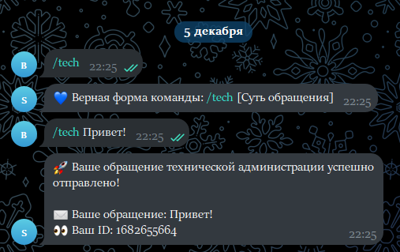

# Handler aiogram bot template


[](https://deepsource.io/gh/rodion-gudz/telegram-bot-template/?ref=repository-badge)
[](https://www.codefactor.io/repository/github/rodion-gudz/telegram-bot-template)




## Installation

```
git clone https://github.com/cls5162/hadnler-aiogram-bot-template.git
pip install aiogram
```
